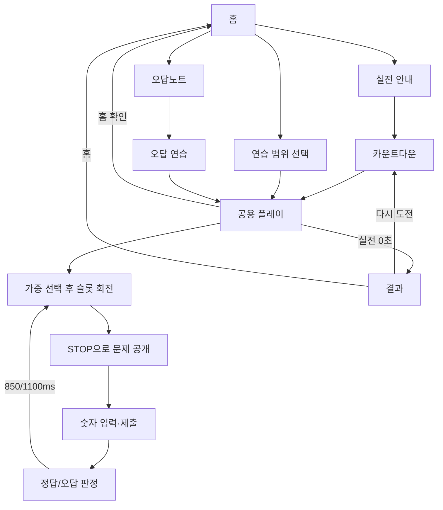

# CODEX-HANDOFF — Seed2 정밀 분석 및 다음 작업 인수인계

> 분석일: 2026-08-08  
> 분석 원칙: 기존 소스·에셋은 읽기 전용으로 유지했다. 이 문서만 새로 작성했다.  
> 분석 범위: 기존 22개 파일 전체(텍스트 8, 이미지 8, 오디오 6)  
> 실행 검증: Node 구문/데이터 검증과 로컬 브라우저의 데스크톱·모바일·가로 회전·새로고침·60초 실전 종료·다중 탭 시나리오  
> 결론: 정적 단일 페이지 앱으로 핵심 학습 흐름은 동작하지만, 저장 경계와 짧은 모바일 viewport에는 우선 수정이 필요한 회귀 위험이 있다.

## 판정 표기

- **브라우저 재현 확인**: 실제 로컬 앱에서 조건과 결과를 확인했다.
- **읽기 전용 실행 확인**: Node VM/구문 검사 등으로 소스를 바꾸지 않고 실행해 확인했다.
- **정적 경로 확정**: 코드상 경로와 결과가 명확하지만 해당 외부 환경까지 만들지는 않았다.
- **잠재 문제**: 필요한 외부 조건이나 기기 조건이 있어 실제 환경 재현이 더 필요하다.
- **확인 필요**: 코드만으로 제품 의도·실데이터·실기기 결과를 확정할 수 없다.

# 1. 프로젝트 현재 상태 요약

## 앱의 목적과 구현 수준

Seed2는 포장검사·종자검사의 작물별/채종단계별 규격 수치를 외우고 푸는 정적 웹 학습 앱이다. 빌드 도구, 서버 API, 계정, 데이터베이스 없이 `index.html`에서 `css/style.css`, `js/data.js`, `js/app.js`를 순서대로 로드한다(`index.html:325-326`). 질문 원천은 `QUESTION_RULES`이며 실행 시 244개의 평탄화된 질문 객체로 변환된다(`js/data.js:37-417`, `js/app.js:1`).

현재 실제 구현된 모드는 다음 세 가지다.

1. **실전모드(`time`)**: 전체 허용 문제를 대상으로 카운트다운 후 60초 동안 반복한다. 시간이 끝나면 정답 수·시도 수·정답률·오답과 최고기록을 결과 화면에 표시한다.
2. **연습모드(`practice`)**: 검사종류·단계 그룹·작물을 선택한 범위에서 종료 조건 없이 반복한다.
3. **오답 연습(`wrong-practice`)**: 저장된 오답노트의 스냅샷만 대상으로 종료 조건 없이 반복한다.

독립적인 **집중훈련 화면/상태**, 숙달 판정, 복습 완료, 사용자 계정, 세션 이력, 진행 중 세션 복원은 구현되어 있지 않다. 현재 코드에서 “집중훈련”에 가장 가까운 기능은 `wrong-practice`이다.

## 주요 화면

| 화면 | DOM | 실제 역할 | 진입/이탈 근거 |
|---|---|---|---|
| 홈 | `#page-home` | 이미지 배경·타이틀·실전/연습/오답노트/설정 4개 버튼 | `index.html:15-57`, `js/app.js:1073-1076` |
| 실전 안내 | `#page-time-intro` modal | 전체 범위, 1분, 기록 저장 안내 | `index.html:60-80`, `js/app.js:456-469` |
| 연습 범위 선택 | `#page-practice-setup` modal | 검사종류 2, 단계 그룹 3, 작물 6 선택 | `index.html:82-115`, `js/app.js:305-375` |
| 공용 플레이 | `#page-play` | 상태/시간, 슬롯 룰렛, 질문, 답안, 모바일 키패드, STOP/제출 | `index.html:117-184`, `js/app.js:675-865` |
| 실전 결과 | `#page-result` | 최고기록, 정답/시도/정확도/오답, 재도전/홈 | `index.html:186-234`, `js/app.js:877-963` |
| 오답노트 | `#page-wrong` modal | 영구 오답 목록, 오답 연습, 전체 삭제 | `index.html:236-256`, `js/app.js:965-999` |
| 설정 | `#page-settings` modal | BGM 0~5, 효과음, 진동 | `index.html:258-307`, `js/app.js:225-260` |
| 카운트다운 | `#countdown-overlay` | 실전 시작 전 3→2→1 표시 | `index.html:309-314`, `js/app.js:571-590` |

## 전체 사용자 흐름



세부 동작은 다음과 같다.

- 앱은 `DOMContentLoaded → init()`으로 시작해 설정, 오답, 최고기록만 복원하고 항상 홈을 표시한다(`js/app.js:1140-1164`).
- 실전은 `startTimeMode()`가 전체 질문 pool을 만들고 공통 상태를 초기화한 뒤 카운트다운을 시작한다(`js/app.js:456-469`). 화면의 3카운트는 700ms 간격이라 실제 약 **2.1초**다(`js/app.js:571-590`).
- 연습은 각 선택 그룹이 1개 이상이고 결과 pool이 비어 있지 않은지 검증한다(`js/app.js:344-375`). 단계 그룹은 `원원종↔원원종포`, `원종↔원종포`, `보급종↔보급종포/채종포 1세대`를 묶는다(`js/app.js:5-9`).
- 질문은 룰렛이 멈출 때 정해지는 것이 아니다. `startRound()`가 질문을 먼저 가중 선택하고, 슬롯은 그 결과를 가리는 시각효과다(`js/app.js:606-728`). 직전 질문만 피하며 pool이 1개이면 같은 질문을 반복한다.
- 가중치는 단계 1~3 × 작물 1~3이다. 따라서 최고 가중 질문은 최저 가중 질문보다 최대 9배 자주 선택될 수 있다. UI의 “무작위”가 균등 무작위를 뜻하는지는 **확인 필요**다.
- 룰렛은 자동으로 멈추지 않는다. STOP 클릭 또는 PC Enter가 필요하며, 실전 타이머는 룰렛 회전 중에도 흐른다(`js/app.js:731-760`, `js/app.js:1106-1118`).
- 모바일은 자체 숫자 키패드, PC는 일반 입력과 Enter 제출을 사용한다(`index.html:160-181`, `js/app.js:646-666`, `js/app.js:804-817`).
- 입력은 `%`, 쉼표를 제거한 뒤 비음수 일반 십진수만 허용한다. 숫자값뿐 아니라 **소수 자릿수까지 같아야 정답**이다(`js/app.js:784-802`). 예를 들어 정답 `0.01`에 `0.010`은 오답이고, `00.01`은 정답이다. 이는 읽기 전용 실행으로 확인했다.
- 정상 흐름에서 `tries = correct + wrong`이다. 정확도는 `Math.round(correct / tries * 100)`의 정수 퍼센트다(`js/app.js:819-865`, `js/app.js:890`).
- 오답은 질문 ID 기준 중복 없이 처음 틀렸을 때만 앞에 추가해 즉시 저장한다. 다시 틀려도 빈도·최근순을 갱신하지 않고, 오답 연습에서 맞혀도 자동 삭제하지 않는다(`js/app.js:868-875`).
- 결과 화면은 실전에서만 존재한다. 연습/오답 연습은 홈 확인창으로 나가야 끝난다.
- 새로고침은 설정·오답·최고기록만 복원하고 홈으로 돌아간다. mode, 선택범위, 현재 문제, 답안, 점수, 남은 시간, 최근 오답은 복원하지 않는다.
- 별도 “새 세션” 버튼은 없다. 각 모드 시작 시 transient run 상태만 초기화하고 영구 오답·설정·최고기록은 보존한다(`js/app.js:378-410`).

## 질문 데이터 현황

읽기 전용 Node 실행으로 다음을 확인했다.

| 구분 | 개수/값 |
|---|---:|
| 전체 질문 | 244 |
| 고유 ID | 244, 중복 0 |
| 포장검사 / 종자검사 | 65 / 179 |
| 벼 / 보리 / 밀 / 콩 / 팥 / 라이밀 | 49 / 47 / 44 / 39 / 38 / 27 |
| 원원종포 / 원종포 / 채종포 1세대 / 보급종포 | 20 / 21 / 21 / 3 |
| 원원종 / 원종 / 보급종 | 57 / 59 / 63 |
| 고유 수치 항목 | 22 |
| 정수 / 소수 1자리 / 소수 2자리 답 | 18 / 122 / 104 |

각 수치 항목은 현재 데이터 안에서 한 가지 소수 자릿수 규칙만 사용한다. 다만 244개 규격값의 업무상 정확성은 원전 자료와 대조하지 않았으므로 **확인 필요**다.

## 저장 방식 요약

저장은 같은 origin의 `localStorage`에 JSON으로 이루어진다. 서버·IndexedDB·cookie·sessionStorage는 없다. 키는 설정, 오답노트, 최고기록 세 개뿐이다(`js/app.js:11-15`, `js/app.js:78-88`). 배포 origin이 바뀌면 동일 키 이름이어도 기존 브라우저 데이터가 보이지 않는다.

## 실행 검증 요약

- JS 두 파일 모두 `node --check` 통과, 질문 ID 중복 0, 브라우저 console warning/error 0.
- 1280×720 데스크톱에서 홈, 연습, STOP, 답안 제출, 다음 문제, 60초 실전 종료와 결과 화면을 확인했다.
- 설정의 BGM/효과음/진동이 새로고침 후 복원되고, 오답이 새 탭/새로고침 후 복원되는 것을 확인했다.
- 오답 연습에서 정답을 맞혀도 해당 오답이 남는 현재 동작을 확인했다.
- 360×620에서 STOP 버튼 대부분이 viewport 밖으로 잘리고, 667×375에서 홈 버튼 hitbox가 겹치며, 390×844→800×390 전환 후 입력이 `readOnly`로 잠기는 것을 재현했다.
- 실전 종료 후 숨은 플레이 슬롯 값이 계속 바뀌어 룰렛 interval 잔류를 재현했다.
- 같은 origin 두 탭에서 서로 다른 오답을 저장하자 나중 탭이 먼저 탭의 신규 오답을 덮어쓰는 것을 재현했다.

# 2. 프로젝트 구조

## 파일 인벤토리

기존 파일은 총 22개다. 모두 분석했다.

| 파일/폴더 | 역할 | 핵심 근거/주의점 |
|---|---|---|
| `index.html` | 모든 화면, 오디오 태그, script 진입점 | 328줄. 구체 DOM ID와 `app.js`가 강결합 |
| `css/style.css` | 전체 UI·반응형 | 1,642줄, `!important` 933회, `@media` 23개. 버전별 hotfix 누적 |
| `js/data.js` | 자산 상수, 규격 원천, 질문 평탄화 | 417줄. 자산 상수는 현재 미사용 |
| `js/app.js` | 상태, 라우팅, 저장, 오디오, 룰렛, 채점, 결과, 이벤트 | 1,164줄의 단일 전역 모듈 |
| `README.md` | starter 설명·자산 규칙·버전 메모 | WebP·별도 룰렛 자산 등 현재 상태 일부 누락 |
| `docs/ROLE_GUIDE.txt` | 파일 역할 요약 | 실제 상세 동작은 담지 않음 |
| `images/home/README.txt` | 홈 자산 이름 목록 | 배경/WebP/roulette 누락 |
| `audio/README.txt` | 오디오 이름 목록 | 6개 파일명 나열 |
| `images/home/*` 8개 | 배경 2포맷, 타이틀, 버튼 4, 별도 룰렛 | 런타임 7개 사용, `home_roulette.png` 미사용 |
| `audio/*` 6개 | 홈/실전/연습 BGM 3, 정답/오답/종료 효과음 3 | 6개 모두 실제 사용 |

## 핵심 전역 의존과 상태

- `data.js`의 `QUESTION_RULES`와 `buildQuestionSet()`이 전역에 먼저 있어야 `app.js:1`이 실행된다. script 순서 변경은 앱 부팅을 깨뜨린다.
- `app.js:22-48`의 단일 mutable `state`가 모든 화면과 기능의 공유 상태다.

| 상태군 | 필드 | 생성/초기화/보존 의미 |
|---|---|---|
| 모드·선택 | `mode`, `selectedExamTypes`, `selectedStageGroups`, `selectedCrops`, `pool` | 모드 시작/선택 검증 때 갱신. 선택은 저장하지 않음 |
| 현재 라운드 | `curQuestion`, `spinning`, `spinIntervals`, `scored`, `runEnded` | `resetRunCommon()`에서 초기화 |
| 점수 | `correct`, `wrong`, `tries`, `recentWrongs` | run마다 초기화; `recentWrongs`는 결과용 |
| 영구 데이터 | `wrongNotes`, `settings`, `timeAttackBest` | 세 localStorage 키에서 복원 |
| 시간 핸들 | `timeLeft`, `timeInterval`, `nextTimeout`, `ngTimeout`, `countdownTimer` | run cleanup 대상. 일부 종료 경로에서 spin cleanup 누락 |
| 오디오 | `audioCtx`, `audioReady`, `currentBgm` | 현재 페이지 생존 동안만 보존 |

## 핵심 함수와 책임

| 함수군 | 주요 함수·위치 | 책임 |
|---|---|---|
| 라우팅/DOM | `showPage`, `openModal`, `closeModal`, `show`, `setText` (`app.js:54-77`) | `.active/.hidden`과 특정 DOM ID 직접 조작 |
| 저장 | `loadJSON`, `saveJSON`, `loadWrongNotes`, `loadBestRecord` (`app.js:78-88,263-303`) | JSON read/write, 제한적 오답 migration |
| 설정/오디오 | `normalizeSettings`~`saveSettings`, `prepareAudio`~`playEffect` (`app.js:137-260`) | 오디오 준비·재생·설정 저장 |
| 연습 범위 | `renderPracticeOptions`, `validatePracticeSelection`, `filterQuestions` (`app.js:305-375`) | 체크박스 생성, 선택 검증, pool 필터 |
| 실행 초기화 | `resetRunCommon`, `resetSlots` (`app.js:378-422`) | timer·점수·입력·슬롯 초기화 |
| 모드 시작 | `startTimeMode`, `startPracticeMode`, `startWrongPracticeMode` (`app.js:456-499`) | mode/pool 결정 후 플레이 진입 |
| 상태 표시 | `updatePlayHeader`, `updateStatus` (`app.js:511-569`) | 모드 문구·점수·시간·진행바 및 inline style 갱신 |
| 시간/선택 | `startCountdown`, `startTimeAttackTimer`, `weightedPick`, `pickQuestion` (`app.js:571-644`) | 카운트다운, interval 시간, 가중 질문 선택 |
| 라운드/룰렛 | `startRound`, `startSpinVisual`, `stopSpin` (`app.js:675-760`) | 질문 선결정, 4개 interval, STOP 공개 |
| 입력/채점 | `normalizeAnswer`~`evaluateAnswer` (`app.js:784-866`) | 형식·소수 자릿수 검증, 점수/피드백, 다음 문제 예약 |
| 결과/오답 | `pushWrongNote`, `finishTimeMode`, `render*`, `clearWrongNotes` (`app.js:868-999`) | 오답 저장, 최고기록·결과, 목록/삭제 |
| 종료/효과 | `handleQuitPlay`, `maybeVibrate`, `maybeBeep` (`app.js:1001-1065`) | 홈 이탈, 진동·WebAudio fallback |
| 이벤트/부팅 | `bindEvents`, `init` (`app.js:1067-1164`) | 이벤트 1회 바인딩, 영구 데이터 로드, 홈 시작 |

## 주요 이벤트와 화면 의존 관계

- `bindEvents()`는 버튼 ID 20개, 모바일 키패드, 전역 Enter, 선택 change, modal 배경 click을 직접 연결한다(`js/app.js:1067-1138`). 반복 플레이 중 재호출하지 않아 정상 흐름에서 listener 중복은 없다.
- STOP은 `spinning/runEnded`, 제출은 `runEnded/curQuestion/scored`, Enter는 repeat/composition/modal/disabled를 검사해 빠른 연속 입력의 중복 채점을 막는다(`js/app.js:731-733`, `js/app.js:819-821`, `js/app.js:1106-1127`).
- 화면 상태는 `.base-page.active`, `.modal-layer.active`, `.hidden`, `.mode-stop`, `.mode-submit`, `.result-feedback`에 의존한다. JS의 `show()`와 CSS의 breakpoint override가 표시 권한을 함께 가져 viewport 전환 버그로 이어진다.
- `updateStatus()`가 progress bar의 position/width를 inline style로 쓰고, CSS 후반부도 같은 속성을 `!important`로 덮는다(`js/app.js:536-568`, `css/style.css:1418-1439`). 상태 권한이 이중화되어 있다.
- `setQuestionText`, `setFeedback`, `makeNoteItem`, `renderSlotValue`는 `innerHTML`을 사용한다. 현재 canonical 질문은 일부 escape하지만 legacy 오답 렌더는 검증/escape가 없다.

## 구조상 유지보수 위험

1. `app.js` 하나가 라우팅, 저장/migration, 오디오, 랜덤, timer, 입력, 채점, 결과를 모두 담당한다. 단순히 “예쁘게” 나누기 위한 전면 재작성은 권장하지 않지만, 저장 경계와 run cleanup처럼 버그가 모이는 경계는 작은 함수로 분리할 가치가 있다.
2. `style.css`에는 v1.2-16/19/20/22/23/24/25/29/30/31/33 override가 누적되어 있다. 뒤 규칙을 보지 않으면 실제 computed style을 오판하기 쉽다(`css/style.css:447-1640`). 기능 수정과 CSS 전면 정리를 같은 단계에서 수행하면 회귀 원인을 분리하기 어렵다.
3. 현재 HTML의 `$()` literal ID 참조는 모두 존재하고 중복 HTML ID도 없다. 그러나 JS가 구체 ID와 class 상태에 강하게 결합되어 DOM 이름 변경은 HTML/JS/CSS 동시 검증이 필요하다.

## 에셋과 외부 리소스

| 자산 | 실제 참조 | 상태 |
|---|---|---|
| `home_bg.webp` 941×1672, 272,438B | `index.html:18`, CSS image-set | 기본 배경, 사용 |
| `home_bg.png` 941×1672, 2,457,384B | HTML onerror, CSS fallback | fallback, 사용 |
| `home_title.png` 559×347 | `index.html:25` | 사용 |
| `btn_home_time.png` 797×225 | `index.html:35` | 사용 |
| `btn_home_practice.png` 764×215 | `index.html:39` | 사용 |
| `btn_home_wrong.png` 955×261 | `index.html:46` | 사용 |
| `btn_home_settings.png` 948×263 | `index.html:50` | 사용 |
| `home_roulette.png` 612×408 | 코드 참조 0 | 미사용. 배경에 유사 룰렛이 합성된 시각적 중복 후보 |
| BGM 3개 | `index.html:316-318`, `app.js:193-201` | 모두 사용, 합계 약 11.85MiB |
| 효과음 3개 | `index.html:319-321`, 채점/종료 | 모두 사용, 합계 약 0.77MiB |
| Google Fonts 4종 | `index.html:7-9`, CSS 여러 선택자 | 유일한 외부 네트워크 의존 |

오디오 6개 전체 크기는 13,234,343B(약 12.62MiB)다. `HOME_ASSETS`/`AUDIO_ASSETS`는 `data.js:18-35`에 정의됐지만 실제 렌더/재생에서 쓰지 않는다. 특히 map에는 WebP와 `bgm_play2`가 반영되지 않아 문서성 상수와 실사용 경로가 어긋난다.

# 3. 반드시 보존해야 하는 계약

## 저장 계약

| 저장 key | 현재 데이터 구조 | 로드·저장 시점 | 사용자 기록 연결 | 변경 위험도 | 분류 |
|---|---|---|---|---|---|
| `seedTraining_v1_2_settings` | `{bgmLevel: number(0..5), sfx: boolean, vibrate: boolean}` | init 로드. BGM ±는 즉시 저장, 효과음/진동은 저장 버튼 | 사용자 환경 설정 | 높음: key/필드 변경 시 설정 유실·재생 정책 변경 | **migration 필요**. 기존 key와 의미는 계속 읽어야 함 |
| `seedTraining_v1_2_wrongNotes` | `Question[]` | init 로드/migration, 첫 오답, 전체 삭제 | 장기 연결은 `(examType, stage, crop, item)` tuple, 실행 중 dedupe는 `id` | 매우 높음: 학습 기록 직접 손실 가능 | **절대 보존에 준함**. schema 변경은 migration 필수 |
| `seedTraining_v1_2_bestTimeAttack` | `{correct, tries, acc}` | init 로드, 더 좋은 실전 결과일 때 저장 | 전체 최고기록 1건 | 높음: 결과/배지 비교와 연결 | **migration 필요**. 기존 기록 의미 보존 |

`loadJSON()`은 파싱 오류만 fallback 처리하고 타입을 검증하지 않으며, `saveJSON()`은 쓰기 예외를 처리하지 않는다(`js/app.js:78-88`). 이 경계가 현재 가장 우선적인 안정화 대상이다.

## 질문·ID·정밀도 계약

| 항목 | 현재 계약 | 연결되는 기능 | 변경 시 위험 | 분류 |
|---|---|---|---|---|
| 질문 ID | ``${examType}__${crop}__${stage}__${item}`` (`data.js:403`) | 오답 중복, 직전 질문 제외, 결과 오답 dedupe | 기존 ID와 새 ID가 이중 기록되거나 dedupe 실패 | **migration 필요** |
| 장기 문제 identity | `examType + stage + crop + item` tuple (`app.js:270-277`) | 저장 오답을 현재 canonical 문제로 연결 | rename/삭제 시 stale 문제 또는 기록 손실 | **절대 보존**, rename alias migration 필요 |
| 질문 shape | `{id, examType, crop, stage, item, answer:string, unit:'%', label}` | 플레이, 채점, 오답 표시/저장 | 필드 누락 시 부팅/표시/채점 오류 | **migration 필요** |
| `answer` 문자열 | 숫자값과 trailing zero를 포함한 정밀도 | guide/placeholder/정답 판정 (`app.js:423-440,791-802`) | `10.00→10.0`은 값이 같아도 허용 답 형식과 정오답이 바뀜 | **절대 보존**. 업무 규칙 변경일 때만 명시적 변경 |
| stage 그룹 | `원원종`, `원종`, `보급종`과 `STAGE_GROUP_MAP` | 연습 필터 | pool 범위가 바뀌고 사용자 기대 회귀 | 변경 가능하나 기능 회귀 검증 필수 |
| 제외 stage | `채종포 2세대` | build와 runtime 필터 | 확대 시 기존 오답이 load 중 삭제·덮어쓰기될 수 있음 | **migration/백업 필수** |
| mode 값 | `time`, `practice`, `wrong-practice` | 상태, header, CSS mode class | 저장되지는 않지만 JS/CSS 분기 동시 파손 | 함께 변경할 때만 비교적 안전 |
| DOM ID/class | 구체 ID와 `.active/.hidden/...` | HTML↔JS↔CSS | migration은 아니나 앱 기능 즉시 파손 | 동시 수정+회귀 테스트 필수 |
| `label` | 생성되지만 현재 소비 코드 없음 | 없음 | 현재 동작 영향 낮음 | **비교적 안전하게 변경 가능** |

## 현재 migration 동작

- 오답 로드 시 crop `트리티케일(사료용) → 라이밀(트리티케일)`, item `피해출현율 → 메벼출현율` 두 alias만 지원한다(`js/app.js:270-271`).
- alias tuple이 현재 질문과 맞으면 현재 canonical 객체 전체로 교체한다. ID/answer 차이나 제외 stage, normalized ID 중복이 있으면 즉시 같은 key에 전체 배열을 덮어쓴다(`js/app.js:268-293`).
- 현재 질문을 찾지 못하면 legacy 스냅샷을 그대로 보존해 오답 연습에서 계속 출제할 수 있다. 이는 기록 손실을 막지만 삭제·rename된 낡은 문제를 계속 푸는 결과도 낳는다.
- migration 저장 감지는 `id/crop/item/answer`만 비교한다. `unit/label`만 바뀐 기록은 메모리에서 canonical이 되어도 저장하지 않아 매 로드마다 같은 canonicalization을 반복한다.
- 설정의 구버전 `bgm:false` 대응 코드는 기본 `bgmLevel:3`을 먼저 합치기 때문에 실제로 작동하지 않는다(`js/app.js:225-230`). 읽기 전용 실행에서 `{bgm:false}`가 `bgmLevel:3`으로 남는 것을 확인했다.
- schema version, 이전 key 탐색, best record migration, dual-read/dual-write는 없다.

## 변경 분류

### A. 절대 보존해야 하는 의미 계약

- 기존 사용자가 세 key에 가진 설정·오답·최고기록을 계속 읽을 수 있어야 한다.
- 오답과 현재 질문을 연결하는 논리 identity와 기록을 임의로 버리지 않는 원칙.
- 답 기준값과 trailing zero를 포함한 소수 자릿수 의미.
- 정상 흐름의 `tries = correct + wrong`, 최고기록의 “correct 우선, 동률이면 rounded acc 우선” 의미를 바꿀 때는 제품 변경으로 명시해야 한다.

### B. 변경 가능하지만 migration이 필요한 요소

- localStorage key literal, 각 객체 필드·타입, Question shape, ID 공식/구분자.
- 검사종류·작물·단계·항목 이름 변경, 질문 삭제, 제외 stage 확대.
- answer 표기 정밀도와 오답 dedupe 규칙.
- 구버전 별칭 추가/제거, 최고기록 비교 규칙 변경.

### C. 비교적 안전하게 변경 가능한 요소

- 현재 미사용 `label`, 미사용 자산 map의 정리, 내부 timer handle/변수명.
- 룰렛 시각 간격, 색상·그림자 등 기능과 분리된 시각 토큰.
- 미사용 CSS/자산은 실제 참조 0과 배포 외부 참조 여부를 한 번 더 확인한 뒤 별도 변경할 수 있다.

## 데이터 손실 별도 경고

1. `loadWrongNotes()`는 제외 stage와 normalized 중복을 제거한 뒤 즉시 같은 key를 덮어쓴다. `EXCLUDED_STAGES`를 늘리면 다음 실행만으로 기존 오답이 백업 없이 영구 삭제될 수 있다.
2. key 이름을 바꾸거나 배포 origin을 바꾸면서 구 key/origin 데이터를 옮기지 않으면 사용자에게는 전 기록이 사라진 것처럼 보인다.
3. 두 탭이 각자 오래된 `wrongNotes` 배열을 메모리에 가진 채 저장하면 마지막 탭의 전체 배열이 먼저 탭의 신규 오답을 덮어쓴다. 브라우저에서 서로 다른 두 오답으로 실제 재현했다.
4. `clearWrongNotes()`는 confirm 후 key를 삭제하는 대신 `[]`로 덮어쓰며 앱 내 복구 기능은 없다(`js/app.js:993-998`).
5. invalid/malformed 저장 데이터를 자동 “정리”할 때 원문을 먼저 덮어쓰지 말아야 한다. 첫 안정화 단계에서는 유효 데이터만 메모리에 채택하고 원문 보존/백업 정책을 별도로 정하는 편이 안전하다.

# 4. 발견된 문제

## 심각도 요약

| 등급 | 개수 | 요약 |
|---|---:|---|
| Critical | 0 | 현재 코드/재현 범위에서 즉시 전 사용자 데이터 파괴나 전면 실행 불가를 확정한 항목은 없음 |
| High | 7 | 저장 shape/write, 실전 시간 계약, 모바일 핵심 조작, 회전 입력 잠김, 다중 탭 기록 손실 |
| Medium | 13 | run cleanup, 설정/복원/migration, CSS·접근성·오디오·모달 안정성 |
| Low | 8 | dead code/문서 drift, 중복·미사용 인자, 카운트다운·시각/문구 세부 |

## Critical

발견된 Critical은 없다. 다만 H-01/H-02는 특정 저장 데이터나 브라우저 저장 제한 조건에서 앱 핵심 흐름을 중단하므로 첫 수정 대상으로 다뤄야 한다.

## High

### H-01. 유효 JSON이지만 잘못된 저장 shape가 부팅/결과 전환을 중단

- **중요도:** High
- **설명:** `loadJSON()`은 JSON 문법만 검사하고 배열/객체 shape를 검증하지 않는다. wrongNotes key가 `null`, `{}`, 숫자, 문자열이면 `loaded.flatMap`에서 예외가 나 `init()`이 멈춘다. best key가 `null`이면 실전 종료 시 `prev.correct`에서 예외가 난다. settings의 `bgmLevel:"abc"`/`2.5` 같은 값도 finite integer 검증 없이 UI와 음량 계산에 들어간다.
- **근거:** `js/app.js:78-85`, `js/app.js:263-268`, `js/app.js:298-300`, `js/app.js:891-904`, `js/app.js:1140-1149`.
- **발생 조건:** 구버전, 확장프로그램, 수동 편집, 부분 저장, 다른 코드가 같은 key에 비호환 JSON shape를 저장한 경우.
- **재현 여부:** **읽기 전용 실행 확인.** mock localStorage에서 wrongNotes `{}`/`null`의 init 예외와 best `null` 경로를 확인했다. 실제 사용자 저장소 변조 재현은 하지 않았다.
- **사용자 영향:** 홈 자체가 뜨지 않거나 60초 종료 후 결과로 넘어가지 못한다. 사용자가 자체 복구할 UI가 없다.
- **데이터 손실 가능성:** 직접 overwrite는 아니지만 앱 접근 불가. 잘못된 “자동 복구”를 추가하면서 원문을 덮으면 손실 가능.
- **수정 시 주의:** 세 key와 valid shape는 그대로 유지한다. plain object/array/finite number validator를 두고, invalid 원문을 load 시 즉시 덮어쓰지 말아야 한다.

### H-02. localStorage 쓰기 예외가 제출/결과 흐름을 멈춤

- **중요도:** High, **잠재 문제**
- **설명:** `saveJSON()`이 quota, security, private-mode 정책 등의 `setItem` 예외를 처리하지 않는다. init의 오답 migration도 저장을 시도하므로 부팅을 중단할 수 있다. 오답 제출은 `state.scored=true` 후 저장을 먼저 시도하고 다음 라운드 예약은 뒤에 한다. 최고기록 저장도 결과 렌더보다 먼저다.
- **근거:** `js/app.js:86-88`, migration `js/app.js:263-296,1140-1149`, 제출 `js/app.js:831-875`, 결과 `js/app.js:893-904`.
- **발생 조건:** 저장공간 부족, storage 차단, sandbox/보안 정책, 브라우저 예외.
- **재현 여부:** 정적 경로 확정. 실제 브라우저 quota/security 조건 재현은 **확인 필요**.
- **사용자 영향:** migration 대상 오답이 있으면 앱이 부팅되지 않고, 한 번 채점된 화면에서 다음 문제로 못 가거나, 실전이 끝났는데 결과 화면이 뜨지 않는다.
- **데이터 손실 가능성:** 새 오답/최고기록 미저장. 이후 사용자 행동에 따라 기록 유실.
- **수정 시 주의:** write 성공 여부와 무관하게 메모리 채점·화면 전이는 계속되어야 한다. 사용자에게 비차단형 저장 실패 안내를 제공하되 반복 알림은 피한다.

### H-03. “1분”이 실제 deadline이 아니라 interval callback 횟수

- **중요도:** High, **잠재 문제**
- **설명:** 시작 timestamp/deadline 없이 1초 callback마다 `timeLeft -= 1`한다. 백그라운드, 화면 잠금, 모바일 sleep, 메인 스레드 지연에서 callback이 늦으면 실제 60초보다 오래 플레이할 수 있다. 0초 직전 입력도 event queue 순서에 따라 포함 여부가 달라진다.
- **근거:** `js/app.js:592-604`, 입력 guard `js/app.js:819-832`, 종료 `js/app.js:877-881`. `visibilitychange/pagehide` 처리 없음.
- **발생 조건:** 탭 비활성화, 기기 잠금/절전, 긴 task, 0초 경계 클릭.
- **재현 여부:** 정적 경로 확정. 일반 foreground 60초 종료는 브라우저에서 정상 확인했으나 background/sleep 경계는 **확인 필요**.
- **사용자 영향:** 최고기록의 공정성과 “1분” 제품 계약이 깨질 수 있다.
- **데이터 손실 가능성:** 직접 손실은 없지만 왜곡된 최고기록이 저장될 수 있다.
- **수정 시 주의:** `Date.now()`/`performance.now()` deadline에서 남은 시간을 매 tick 재계산하고, 기존 60초 표시·결과·재도전 의미를 보존한다. 0초 cutoff를 단일 규칙으로 정의한다.

### H-04. 짧은 모바일 viewport에서 STOP/제출 영역이 화면 아래로 잘림

- **중요도:** High
- **설명:** 모바일 play를 `100svh + overflow:hidden` 고정 grid로 만들면서 answer-zone 최소높이와 상단 요소 최소높이 합이 짧은 화면을 초과한다. 짧은 화면 hotfix는 키 높이만 줄이고 answer-zone/grid 예약 높이는 그대로 둔다.
- **근거:** `css/style.css:473-478`, 최종 mobile grid `css/style.css:988-1060`, 짧은 화면 hotfix `css/style.css:1548-1552,1622-1640`.
- **발생 조건:** 360×620 등 세로 가용 높이가 짧은 모바일.
- **재현 여부:** **브라우저 재현 확인.** 360×620에서 `#answer-zone`은 y=374.15~666.15, STOP은 y=616.15~666.15였다. viewport 아래 46px이 잘려 스크린샷에 버튼이 사실상 보이지 않았다. body/page scrollHeight도 620이고 overflow가 막혀 스크롤 복구가 안 됐다.
- **사용자 영향:** 룰렛을 멈출 수 없어 문제 입력 단계로 진행하지 못한다.
- **데이터 손실 가능성:** 없음. 실전이면 시간만 소모되고 결과가 0건으로 끝날 수 있음.
- **수정 시 주의:** 키만 더 작게 만들지 말고 전체 grid의 최소높이/overflow/scroll 전략을 다시 계산한다. 44px 터치 영역을 가능한 한 보존한다.

### H-05. 모바일 가로/짧은 홈에서 이미지 버튼과 hitbox가 충돌

- **중요도:** High
- **설명:** 배경은 `object-fit:cover`, 오버레이는 viewport 비율의 절대 top/left/width와 intrinsic aspect-ratio/min-height를 사용한다. 원본 941:1672보다 넓은 viewport에서 배경 crop 좌표와 버튼 좌표가 어긋나고 버튼끼리 겹친다.
- **근거:** `css/style.css:453-459,472-484`, `css/style.css:1554-1616`, DOM 순서 `index.html:32-53`.
- **발생 조건:** 667×375 같은 ≤700px 가로 화면; 360×568에서도 경계 겹침 시작.
- **재현 여부:** **브라우저 재현 확인.** 667×375에서 time/practice hitbox가 세로 77px 겹쳤고, practice와 하단 버튼은 56.5px 겹쳤다. 제목/버튼 일부는 viewport 밖으로 나갔다. 360×568에서도 인접 버튼이 0.5~2.1px 겹쳤다.
- **사용자 영향:** 보이는 버튼과 실제 클릭 대상이 다르거나 다른 메뉴가 실행될 수 있다.
- **데이터 손실 가능성:** 없음.
- **수정 시 주의:** 원본 941:1672 좌표계를 하나의 contain stage로 유지하거나 object-fit 변환값에 hitbox를 연동한다. 시각만 맞추고 DOM hitbox를 따로 두지 않는다.

### H-06. 700px breakpoint 전환 후 답안 입력이 잠김

- **중요도:** High
- **설명:** `isMobileView()`는 순간의 media query만 읽고 `setMobileControlsActive()`가 `readOnly`와 표시 class를 일회 설정한다. resize/orientation/media-query change listener가 없다.
- **근거:** `js/app.js:50-52`, `js/app.js:646-666`, `js/app.js:731-760`, 전체 event binding `js/app.js:1067-1164`.
- **발생 조건:** 모바일 폭에서 STOP 후 입력 단계에 들어간 다음 700px 초과로 회전/창 크기 변경.
- **재현 여부:** **브라우저 재현 확인.** 390×844에서 STOP 후 `readOnly=true`, keypad=`grid`; reload 없이 800×390으로 전환하자 media query는 desktop, keypad=`none`인데 input은 `readOnly=true`로 남았다.
- **사용자 영향:** 현재 문제에 답을 입력할 방법이 없어 세션을 포기해야 한다. 반대 방향은 모바일 전용 키패드가 복구되지 않는다.
- **데이터 손실 가능성:** 진행 중 transient 점수/시간 손실 가능.
- **수정 시 주의:** 현재 phase(spin/submit/feedback/result)를 기준으로 controls를 재동기화한다. 단순 resize마다 새 round를 시작하거나 답안을 초기화하면 안 된다.

### H-07. 다중 탭에서 오답 배열 전체 덮어쓰기로 신규 기록이 조용히 손실

- **중요도:** High
- **설명:** 각 탭이 init 시 `wrongNotes` 전체 배열을 메모리에 읽고, 신규 오답 때 그 배열 전체를 `setItem`한다. `storage` event/merge/version이 없어 마지막 저장이 다른 탭의 중간 추가분을 지운다.
- **근거:** `js/app.js:263-297`, `js/app.js:868-875`. storage event listener 없음.
- **발생 조건:** 같은 origin 앱을 두 탭/창에서 열고 각자 서로 다른 오답을 제출.
- **재현 여부:** **브라우저 재현 확인.** 두 탭이 각각 `라이밀/잡초종자`, `콩/이품종`을 틀렸고, 두 번째 탭 저장 뒤 새 탭에는 두 번째 오답과 이전 기존 오답만 남아 첫 번째 신규 오답이 사라졌다.
- **사용자 영향:** 사용자는 저장됐다고 본 학습 기록을 알림 없이 잃는다.
- **데이터 손실 가능성:** **있음, 실제 재현.**
- **수정 시 주의:** 저장 직전 최신 persisted 배열을 다시 읽어 canonical ID 기준 merge하거나 revision을 둔다. 삭제와 추가의 충돌 정책, 기존 순서를 먼저 정의한다.

## Medium

### M-01. 결과/홈 이동 후 룰렛 interval 4개가 계속 실행

- **중요도:** Medium
- **설명:** 검사종류 1개와 슬롯 3개의 interval을 만들지만 `finishTimeMode()`와 `handleQuitPlay()`는 이를 정리하지 않는다.
- **근거:** 생성 `js/app.js:699-728`; 정상 STOP/새 run 정리 `js/app.js:712-736,378-391`; 누락 `js/app.js:877-909,1001-1010`.
- **발생 조건:** 룰렛 회전 중 시간이 끝나거나 STOP 전에 홈 종료.
- **재현 여부:** **브라우저 재현 확인.** 실전 결과 화면에서 숨은 슬롯 값을 170ms 간격으로 읽자 5회 모두 계속 변했다.
- **사용자 영향:** 새 모드/reload까지 불필요한 DOM 갱신·CPU·배터리 사용. 현재 reset 시 정리되어 무한 누적은 확인되지 않음.
- **데이터 손실 가능성:** 없음.
- **수정 시 주의:** 공통 `cleanupRun()`에서 time/countdown/next/ng/spin을 모두 정리하고 handle을 null화한다.

### M-02. 설정을 저장하지 않고 닫으면 UI와 실제 state가 달라짐

- **중요도:** Medium
- **설명:** 효과음/진동 checkbox는 저장 버튼에서만 state에 반영되지만 X/배경 닫기와 재열기는 DOM 값을 rollback/reload하지 않는다. BGM ±는 반대로 즉시 state와 storage에 저장한다.
- **근거:** `js/app.js:236-260`, `js/app.js:1076,1101-1104,1133-1136`.
- **발생 조건:** 효과음/진동을 바꾼 뒤 저장하지 않고 닫고 재열기.
- **재현 여부:** **브라우저 재현 확인.** 재열기 UI는 바뀐 값인데 reload 후에는 이전 저장값으로 돌아왔다.
- **사용자 영향:** 무엇이 실제 적용/저장됐는지 오해한다.
- **데이터 손실 가능성:** 사용자가 저장됐다고 오인한 변경이 사라짐.
- **수정 시 주의:** modal draft를 따로 두고 저장 시 commit하거나, 닫기 시 DOM을 state로 rollback한다. BGM도 동일 정책으로 맞출지 제품 결정 필요.

### M-03. 새로고침이 진행 중 세션을 무조건 폐기

- **중요도:** Medium, 제품 의도 **확인 필요**
- **설명:** 영구 key는 세 종류뿐이며 `init()`은 항상 홈으로 간다. 모드, 선택, 점수, 시간, 현재 문제/답안은 저장하지 않는다.
- **근거:** `js/app.js:11-15,22-48,1140-1149`.
- **발생 조건:** 카운트다운, 플레이, 결과 중 reload/브라우저 재시작.
- **재현 여부:** **브라우저 재현 확인.** 연습 중 reload 후 홈, 오답/설정만 복원됨.
- **사용자 영향:** 진행 점수와 남은 시간이 사라진다.
- **데이터 손실 가능성:** transient session 기록 손실. 영구 오답/최고기록은 보존.
- **수정 시 주의:** 세션 복원이 제품 요구인지 먼저 확정한다. 구현한다면 deadline, current ID, phase, score schema와 version을 새 계약으로 설계해야 한다.

### M-04. 카운트다운 중 종료 경로에서 overlay class 정리 누락

- **중요도:** Medium, **잠재 문제**
- **설명:** overlay의 `.active`는 정상 카운트다운 완료 때만 제거한다. `handleQuitPlay()`는 interval만 clear하고 overlay class를 제거하지 않는다.
- **근거:** `js/app.js:571-590`, `js/app.js:1001-1010`, `showPage` `js/app.js:56-71`.
- **발생 조건:** overlay가 포인터를 막는 동안 키보드/보조기술/프로그램 경로로 플레이 홈을 실행해 종료.
- **재현 여부:** 정적 경로 확정. 일반 pointer만으로는 overlay가 막아 실사용 재현은 **확인 필요**.
- **사용자 영향:** 홈 위에 전체화면 overlay가 남아 앱을 조작하지 못할 수 있다.
- **데이터 손실 가능성:** 진행 세션 손실 가능.
- **수정 시 주의:** 모든 run cleanup에서 overlay class/text도 원상복구한다.

### M-05. 구버전 `bgm:false` 설정 migration이 실질적으로 실패

- **중요도:** Medium
- **설명:** 기본 object에 `bgmLevel:3`을 먼저 넣어 `typeof out.bgmLevel === 'undefined'`가 성립하지 않는다.
- **근거:** `js/app.js:225-230`.
- **발생 조건:** 기존 설정이 `{bgm:false,...}`이고 `bgmLevel`이 없는 경우.
- **재현 여부:** **읽기 전용 실행 확인.** 결과가 level 0이 아니라 3으로 남았다.
- **사용자 영향:** 이전에 끈 BGM이 새 버전에서 켜질 수 있다.
- **데이터 손실 가능성:** 설정 의미 손실.
- **수정 시 주의:** raw own-property를 기본값 merge 전에 판정하고, 기존 `bgmLevel`이 있으면 우선한다.

### M-06. stale/비정상 오답을 검증 없이 보존하고 innerHTML로 렌더

- **중요도:** Medium, **잠재 문제**
- **설명:** 현재 질문에 매칭되지 않은 legacy 객체는 그대로 보존된다. `makeNoteItem()`은 examType/crop/stage/item/answer/unit를 escape하지 않고 `innerHTML`에 넣고, slot의 하이픈 item과 결과의 best correct도 `innerHTML`을 쓴다.
- **근거:** `js/app.js:268-290`, `js/app.js:899`, `js/app.js:980-989`, `js/app.js:1018-1025`.
- **발생 조건:** 오염된 same-origin localStorage, 비호환 구버전 객체, 제거된 질문.
- **재현 여부:** 정적 경로 확정. 정상 앱이 생성한 canonical 데이터만으로는 발생하지 않음.
- **사용자 영향:** 깨진 목록/문제, `undefined` 표시, 잠재 DOM injection.
- **데이터 손실 가능성:** 직접 overwrite는 migration 조건에 따라 가능. 잘못된 필터링 수정 시 기록 손실 주의.
- **수정 시 주의:** 렌더는 textContent/escape를 사용하고, stale record는 자동 삭제보다 격리/표시/복구 정책을 먼저 정한다.

### M-07. CSS cascade와 JS/CSS 이중 표시 권한이 회귀를 키움

- **중요도:** Medium
- **설명:** 1,642줄 CSS에 `!important` 933회와 버전별 override가 쌓여 같은 요소를 반복 재정의한다. JS의 `.hidden`과 CSS의 mode/breakpoint가 표시를 동시에 결정한다. 예를 들어 v24의 모바일 선택범위 줄바꿈(`white-space:normal`)을 뒤 v25의 `nowrap + overflow:hidden`이 다시 덮어 긴 선택 요약을 자른다.
- **근거:** `css/style.css:398-444,447-749,752-1060,1273-1283,1378-1404,1618-1640`; JS `show()`와 mobile controls `js/app.js:72-76,523-527,646-666`.
- **발생 조건:** answer-zone/keypad/q-text/home 배치를 수정하거나 새 breakpoint 추가.
- **재현 여부:** 정적 확정. H-04/H-06이 실제 기능 영향 사례다.
- **사용자 영향:** 작은 CSS 변경이 특정 기기에서 핵심 버튼을 숨길 수 있다.
- **데이터 손실 가능성:** 없음.
- **수정 시 주의:** 기능 버그 수정과 전면 CSS 정리를 분리하고, computed-style viewport matrix를 먼저 만든다.

### M-08. modal/input의 접근성·키보드 계약 부족

- **중요도:** Medium
- **설명:** modal에 `role=dialog`, `aria-modal`, 제목 연결, open focus 이동, focus trap/복원, Escape 닫기가 없다. 홈 trigger에 focus가 남아 키보드로 overlay 뒤의 다른 버튼을 실행하면 modal이 둘 이상 동시에 active가 될 수 있다. 답안 input은 label/aria-label 없이 placeholder만 있고 상태 변화에 aria-live가 없다. switch input은 0×0이라 명확한 focus 표시가 없다.
- **근거:** `index.html:60-115,160-181,236-307,309-314`; `css/style.css:370-375`; `js/app.js:62-71,1067-1138`.
- **발생 조건:** 키보드, 스크린리더, switch control 사용.
- **재현 여부:** DOM 정적 확인. 보조기기 실사용은 **확인 필요**.
- **사용자 영향:** modal 배경으로 포커스가 빠지거나, 문제/피드백/시간 변화를 알 수 없고, 닫기 어렵다.
- **데이터 손실 가능성:** 없음.
- **수정 시 주의:** visual layout 변경과 분리해 semantic/focus 회귀를 테스트한다.

### M-09. 짧은 화면의 터치 타깃과 safe-area 대응 부족

- **중요도:** Medium
- **설명:** 상단 버튼 34px, modal close 40px, volume 34px, 짧은 화면 keypad 28~30px까지 줄어든다. viewport meta에 `viewport-fit=cover`가 없고 safe-area는 일부 bottom에만 사용한다.
- **근거:** `index.html:5`; `css/style.css:103,465,1013-1015,1548-1552,1622-1640`; safe-area `css/style.css:402,431,475,479,991`.
- **발생 조건:** 노치/가로/PWA, 손가락 입력, 짧은 viewport.
- **재현 여부:** computed size 정적/브라우저 확인. iOS standalone은 **확인 필요**.
- **사용자 영향:** 오입력, 상단/측면 침범, 컨트롤 접근성 저하.
- **데이터 손실 가능성:** 없음.
- **수정 시 주의:** H-04를 고치면서 타깃을 더 줄이는 방식은 피한다.

### M-10. 모션 감소 설정을 무시

- **중요도:** Medium
- **설명:** STOP pulse, 슬롯 0.1초 반복, shake, page fade, trophy, confetti가 있지만 `prefers-reduced-motion` 규칙이 없다.
- **근거:** `css/style.css:53,87-88,292-327,342-347,469-470`; confetti 생성 `js/app.js:911-939`.
- **발생 조건:** OS에서 motion reduction을 요청한 사용자.
- **재현 여부:** 정적 확정.
- **사용자 영향:** 어지럼/주의분산, 접근성 저하.
- **데이터 손실 가능성:** 없음.
- **수정 시 주의:** 기능 timing과 시각 animation을 분리한다. 룰렛 상태 전이는 유지하되 animation만 축소한다.

### M-11. 긴 룰렛 문자열과 외부 폰트 fallback의 clip 가능성

- **중요도:** Medium, **잠재 문제**
- **설명:** slot은 3열·`overflow:hidden`·`word-break:keep-all`이고 길이 8/11 기준으로만 font를 줄인다. `라이밀(트리티케일)`, `메성배유개체출현율`은 좁은 모바일에서 넘칠 수 있다. Google Fonts 실패 시 글자폭도 달라진다.
- **근거:** `css/style.css:284-300,1026-1030`; `js/app.js:1012-1030`; 데이터 `js/data.js:140-156,219-247,366-390`; font `index.html:7-9`.
- **발생 조건:** 좁은 3열, 긴 item/crop, font 차단/오프라인.
- **재현 여부:** 정적 위험 확인. 대표 기기/폰트 on-off 시각 확인은 **확인 필요**.
- **사용자 영향:** 문제 context를 읽지 못해 답변이 어렵다.
- **데이터 손실 가능성:** 없음.
- **수정 시 주의:** 데이터 이름을 줄여 identity를 바꾸지 말고, 표시용 wrapping/scale만 조정한다.

### M-12. 오디오 초기 로드·종료 중첩·백그라운드 정책 미정

- **중요도:** Medium
- **설명:** 6개 audio가 모두 `preload=auto`이고 init에서 사용자 제스처 전 `load()`를 호출해 약 12.62MiB 전체 로드를 예약한다. 종료 효과음(약 1.595초) 시작 750ms 뒤 홈 BGM을 재생해 약 0.845초 겹친다. visibility/pagehide 정지 정책도 없다.
- **근거:** `index.html:316-321`; `js/app.js:152-223,877-908,1140-1161`.
- **발생 조건:** 모바일 데이터/느린 네트워크, 실전 종료, background 전환.
- **재현 여부:** 파일 크기·길이·코드 timing 확정. 실제 네트워크 요청량/청감/OS background 재생은 **확인 필요**.
- **사용자 영향:** 첫 로드 데이터 비용, 겹치는 소리, background BGM 가능성.
- **데이터 손실 가능성:** 없음.
- **수정 시 주의:** 브라우저 autoplay 복구(`play().catch`, unlock)를 보존하고, preload와 재생 정책을 별도 테스트한다.

### M-13. 짧은 modal의 내부/목록 이중 스크롤

- **중요도:** Medium, **잠재 문제**
- **설명:** modal은 `max-height:86vh; overflow:auto`, 오답 목록은 다시 `max-height:300px; overflow-y:auto`다. `dvh/svh`가 아니며 absolute close 버튼도 content와 함께 스크롤된다.
- **근거:** `css/style.css:97-103,357-360`.
- **발생 조건:** 주소창이 변하는 짧은 모바일 viewport, 긴 오답 목록.
- **재현 여부:** 정적 경로 확정. iOS Safari/실기기 조작은 **확인 필요**.
- **사용자 영향:** 이중 스크롤, 닫기/저장 버튼 접근 어려움.
- **데이터 손실 가능성:** 없음.
- **수정 시 주의:** modal shell과 list 중 한 곳만 주 scroll owner가 되도록 설계한다.

## Low

### L-01. 자산 map/README와 실사용 경로 불일치

- **중요도:** Low
- **설명:** `HOME_ASSETS`/`AUDIO_ASSETS`는 미사용이고 WebP/`bgm_play2`를 반영하지 않는다. README도 WebP/roulette 일부를 누락하며 변경 기록은 v1.2-23에서 끝나지만 화면 표기는 v1.2-33이다(`index.html:266`). `home_roulette.png`는 참조 0이고 배경 룰렛과 시각적으로 중복된다.
- **근거:** `js/data.js:2-35`, `index.html:18,316-321`, 각 README.
- **발생 조건:** 다음 작업자가 map/README만 믿고 자산을 교체.
- **재현 여부:** 참조 검색과 이미지 확인으로 확정.
- **사용자 영향:** 잘못된 파일을 수정하거나 미사용 파일에 작업할 수 있음.
- **데이터 손실 가능성:** 없음.
- **수정 시 주의:** 배포 외부 참조 여부를 확인하고 문서/단일 source 정리는 별도 단계에서 수행한다.

### L-02. 구형 홈/컨트롤 CSS dead code

- **중요도:** Low
- **설명:** 현 DOM에 없는 `.home-orn`, `.hero-card`, `.machine*`, `.slots-shell`, `.hero-slot`, `.home-btns`, `.ctrl-group`, `.btn-green` 등이 남아 있다.
- **근거:** `css/style.css:86,109-135,311` 및 전체 HTML/JS 참조 0.
- **발생 조건:** CSS 수정/검색 시 구형 규칙을 현행으로 오인.
- **재현 여부:** 정적 확정.
- **사용자 영향:** 유지보수 시간 증가.
- **데이터 손실 가능성:** 없음.
- **수정 시 주의:** 사용 여부가 의심되는 선택자는 한 번에 삭제하지 말고 computed DOM/외부 embedding 확인 후 별도 commit.

### L-03. cleanup 중복과 미사용 인자

- **중요도:** Low
- **설명:** `handleQuitPlay()`가 `ngTimeout`을 두 번 clear하고 spin cleanup은 빠져 있다. `ensureHomeBgm(force)`, `maybeBeep(type, force)`의 `force`는 사용하지 않는다.
- **근거:** `js/app.js:203,1003-1007,1038`.
- **발생 조건:** 향후 cleanup/오디오 수정 시 잘못된 의도를 추론.
- **재현 여부:** 정적 확정.
- **사용자 영향:** 직접 영향은 낮지만 패치 흔적이 M-01 누락을 숨긴다.
- **데이터 손실 가능성:** 없음.
- **수정 시 주의:** M-01 공통 cleanup과 함께 의미를 확인한 뒤 정리한다.

### L-04. 3카운트가 약 2.1초

- **중요도:** Low
- **설명:** 3,2,1을 700ms 간격으로 바꾸고 0에서 즉시 시작한다.
- **근거:** `js/app.js:571-590`.
- **발생 조건:** 실전 시작.
- **재현 여부:** 브라우저에서 약 2.1초 후 overlay 종료 확인.
- **사용자 영향:** “3초 준비” 기대와 다를 수 있음.
- **데이터 손실 가능성:** 없음.
- **수정 시 주의:** 제품이 빠른 연출을 의도했는지 먼저 확인한다.

### L-05. 일부 클릭의 오디오/진동 중복과 보이지 않는 저장 피드백

- **중요도:** Low, 잠재
- **설명:** 홈에 pointerdown/touchstart/click 세 handler와 window unlock 네 handler가 있고, 설정 저장 wrapper와 `saveSettings()`가 각각 `maybeBeep('button')`을 호출한다. `saveSettings()`의 “설정을 저장했어요.”는 홈 뒤 숨은 play feedback에 써 사용자에게 보이지 않는다.
- **근거:** `js/app.js:259-260,1068-1071,1101,1150-1161`.
- **발생 조건:** 첫 홈 touch, SFX가 켜진 상태에서 설정 저장.
- **재현 여부:** 정적 경로 확정. `currentBgm` guard가 대부분 중복 재생을 막아 청감 재현은 **확인 필요**.
- **사용자 영향:** 이중 beep/vibration 또는 불필요한 play 시도, 저장 성공 피드백 부재.
- **데이터 손실 가능성:** 없음.
- **수정 시 주의:** autoplay unlock에 필요한 최초 gesture는 보존한다.

### L-06. 홈 이미지 로드 중 fallback flex와 alt 세부 불일치

- **중요도:** Low, 잠재
- **설명:** image와 fallback이 같은 flex container의 형제이고 성공 후 fallback을 숨긴다. 느린 로드 중 반폭/flicker 가능성이 있다. title 실제 문구와 alt “종자검사 트레이닝”도 완전히 일치하지 않는다.
- **근거:** `index.html:24-51`, `css/style.css:183-217`, `js/app.js:91-121`.
- **발생 조건:** cold cache/느린 이미지 로드, 이미지 실패, 스크린리더.
- **재현 여부:** 정적 가능성. throttled 첫 paint는 **확인 필요**.
- **사용자 영향:** 순간 레이아웃 흔들림, 대체 설명 정확도 저하.
- **데이터 손실 가능성:** 없음.
- **수정 시 주의:** fallback 자체의 asset-missing 복구 기능은 유지한다.

### L-07. 연습 진행바와 가중 무작위의 사용자 의미가 명시되지 않음

- **중요도:** Low, **확인 필요**
- **설명:** 연습 progress width는 `correct / max(10, correct+wrong+1)`이고 완료 목표가 없다. 실전/연습 질문은 명시적 가중 선택이지만 안내는 단순 “무작위”다.
- **근거:** `js/app.js:536-568,606-644`, `index.html:70-73`.
- **발생 조건:** 사용자가 bar를 진도/정확도로 해석하거나 균등 출제를 기대.
- **재현 여부:** 계산/문구 정적 확정, 제품 의도 미확정.
- **사용자 영향:** 진행/출제 분포 오해.
- **데이터 손실 가능성:** 없음.
- **수정 시 주의:** 알고리즘을 먼저 바꾸지 말고 bar/가중치의 의도를 확정한다.

### L-08. unit/label만 바뀐 오답 migration은 저장 감지하지 않음

- **중요도:** Low
- **설명:** canonical object를 메모리에 쓰지만 migrated 판정은 id/crop/item/answer만 비교한다.
- **근거:** `js/app.js:278-293`.
- **발생 조건:** unit 또는 label만 변경/누락된 legacy record.
- **재현 여부:** 정적 확정.
- **사용자 영향:** 매 reload마다 같은 canonicalization 반복, 저장 원문은 계속 낡음.
- **데이터 손실 가능성:** 없음.
- **수정 시 주의:** 필드 비교를 늘리면서 stale record를 무조건 삭제하지 않는다.

# 5. 권장 작업 순서

전면 재작성보다 아래 순서의 작은 변경을 권장한다. 각 단계는 이전 단계의 회귀 테스트가 통과한 뒤 별도 commit/세션으로 진행한다.

## 1단계 — localStorage 경계 비파괴 안정화

- **목표:** H-01/H-02를 해결해 malformed/legacy 데이터와 write 실패가 앱·채점·결과 전이를 중단하지 않게 한다.
- **수정 가능성이 높은 파일:** `js/app.js`. 필요하면 독립 테스트 fixture/script를 추가하되 `js/data.js` 규격값은 건드리지 않는다.
- **보존해야 할 기능:** 세 key literal, valid settings/wrongNotes/best shape, 질문 ID/tuple, answer string 정밀도, alias migration, 현재 최고기록 비교.
- **회귀 위험:** 잘못된 validator가 유효한 기존 오답을 버리거나, fallback을 같은 key에 저장해 원문을 파괴할 수 있다.
- **수정 전 확인:** 실제 구버전 raw sample 유무, invalid raw를 보존/백업할 정책, 저장 실패 UX.
- **완료 후 테스트:** key 없음/정상 데이터/invalid JSON/`null`/`{}`/잘못된 필드/legacy alias/`setItem` throw를 각각 검증. 특히 alias·중복·제외 stage migration이 write를 시도할 때 `setItem`이 throw해도 부팅되어야 하며, 오답 후 다음 round와 60초 결과도 계속되어야 한다.

## 2단계 — 오답 동시성·migration 정책 보강

- **목표:** H-07, M-05, M-06, L-08을 분리해서 해결한다. 저장 직전 최신 오답과 ID merge, legacy settings 판정, stale record 정책, 안전 렌더를 마련한다.
- **수정 가능성이 높은 파일:** `js/app.js`; migration fixture가 필요하면 새 테스트 파일.
- **보존해야 할 기능:** 기존 순서, 중복 1개 정책, 두 alias, 맞혀도 오답이 자동 삭제되지 않는 현재 제품 동작(변경하려면 별도 승인).
- **회귀 위험:** 삭제와 추가가 충돌할 때 지운 기록이 되살아나거나, duplicate merge가 최근순을 바꿀 수 있다.
- **수정 전 확인:** 다중 탭 사용을 공식 지원할지, stale 문제를 숨김/보존/격리 중 어떻게 다룰지, clear와 동시 add 충돌 규칙.
- **완료 후 테스트:** 두 탭 동시 add, 동일 ID 동시 add, 한 탭 clear/다른 탭 add, alias canonicalization, unit/label 변경, markup 포함 legacy record.

## 3단계 — run lifecycle cleanup과 deadline timer

- **목표:** H-03, M-01, M-04를 해결한다. 모든 timer/interval/overlay를 한 cleanup 경계로 모으고 실전 시간을 deadline 기반으로 계산한다.
- **수정 가능성이 높은 파일:** `js/app.js`.
- **보존해야 할 기능:** 60초 표시, 룰렛/STOP 흐름, 850/1100ms 피드백, 결과/최고기록, 다시 도전, 실전 중 time bar 감소 방향.
- **회귀 위험:** cleanup 시점이 너무 빠르면 마지막 답/효과음/결과가 누락되고, retry가 이전 run handle을 공유할 수 있다.
- **수정 전 확인:** 0초 경계 답안을 포함할지 제외할지, background 복귀 즉시 종료 UX, 3카운트 길이 의도.
- **완료 후 테스트:** spin/answer/feedback/countdown 각 phase에서 홈, spin/answer 경계에서 0초, background/sleep 후 복귀, 결과→retry 반복 10회, 숨은 슬롯 값 정지 확인.

## 4단계 — 플레이 반응형 핵심 조작 복구

- **목표:** H-04/H-06을 해결해 작은 세로 화면과 700px 전환에서 STOP·입력·제출이 항상 가능하게 한다.
- **수정 가능성이 높은 파일:** `css/style.css`, `js/app.js`; HTML 변경은 필요한 경우 최소화.
- **보존해야 할 기능:** 모바일 custom keypad, PC native input/Enter, 현재 답안과 `scored` guard, safe-area bottom, 질문/guide/feedback 순서.
- **회귀 위험:** resize가 현재 답을 지우거나 중복 listener를 만들 수 있고, scroll 허용이 이중 스크롤로 바뀔 수 있다.
- **수정 전 확인:** 지원 최소 viewport, 가로모드 지원 수준, 44px touch 목표.
- **완료 후 테스트:** 320×568, 360×620, 360×640, 375×667, 390×844, 1280×720; spin/submit/feedback 중 각각 699↔701px 전환; STOP/키패드/제출 bounding box가 viewport 안인지 자동 확인.

## 5단계 — 홈 좌표계와 hitbox 정합성

- **목표:** H-05를 해결해 배경 crop과 버튼/타이틀 좌표계를 일치시킨다.
- **수정 가능성이 높은 파일:** `css/style.css`, 필요하면 `index.html`.
- **보존해야 할 기능:** 941×1672 원본 아트, WebP→PNG fallback, 네 메뉴의 aria-label과 click handler.
- **회귀 위험:** 세로 화면에서 이미 맞는 위치가 틀어지거나, 보이는 이미지와 투명 hitbox가 달라질 수 있다.
- **수정 전 확인:** 가로모드를 지원할지 회전 제한 안내할지, 원본 아트의 기준 좌표.
- **완료 후 테스트:** 360×568, 360×620, 390×844, 667×375, 812×375, 1280×720에서 image와 hitbox 시각/수치 확인; pairwise overlap 0.

## 6단계 — 설정·접근성·모달·오디오 보완

- **목표:** M-02, M-08~M-13을 작은 하위 작업으로 나눠 개선한다.
- **수정 가능성이 높은 파일:** `index.html`, `css/style.css`, `js/app.js`.
- **보존해야 할 기능:** 기존 설정 shape와 음량 0~5 의미, autoplay unlock fallback, modal 배경 닫기, 모바일 결과 scroll.
- **회귀 위험:** focus trap이 background hotkey를 막거나, preload 변경으로 첫 효과음이 늦고, modal scroll owner 변경으로 버튼이 숨을 수 있다.
- **수정 전 확인:** 설정 draft/즉시 저장 정책, SFX/BGM mixing, iOS/PWA 지원, 접근성 목표.
- **완료 후 테스트:** 저장/취소/reopen/reload 조합, 키보드 Tab/Escape/focus 복원, screen reader live region, reduced motion, 오프라인 font, 긴 문자열, 긴 오답 목록, 네트워크 throttling/오디오 청취.

## 7단계 — CSS/자산/문서 정리

- **목표:** 기능 안정화 뒤 M-07과 Low dead/drift 항목을 정리한다.
- **수정 가능성이 높은 파일:** `css/style.css`, `js/data.js`, README 3개, 필요하면 미사용 자산.
- **보존해야 할 기능:** 모든 computed layout, 현재 이미지/오디오 fallback, DOM ID/class 계약.
- **회귀 위험:** 오래된 override처럼 보여도 후반 cascade의 전제가 될 수 있다. `home_roulette.png`가 배포 외부에서 쓰이는지는 repo만으로 확정 못 한다.
- **수정 전 확인:** viewport별 computed-style baseline, 외부 배포/embedding 참조, 자산 단일 source 설계.
- **완료 후 테스트:** 전체 회귀 체크리스트, visual screenshot comparison, 모든 경로 200/console error 0, asset reference scan.

# 6. 회귀 테스트 체크리스트

## 테스트 데이터 세트

- [ ] localStorage 세 key가 모두 없는 최초 실행.
- [ ] 정상 settings/wrongs/best가 있는 기존 사용자.
- [ ] legacy crop/item alias가 있는 오답.
- [ ] `bgm:false`만 있는 legacy 설정.
- [ ] invalid JSON, JSON `null`, `{}`, 배열 아닌 wrongNotes, 필드 누락 Question, non-finite/문자 best.
- [ ] 저장 write가 quota/security 예외를 던지는 환경/mock.
- [ ] 오답 0개, 1개, 수백 개.

## 최초 실행·홈·모달

- [ ] 최초 실행이 홈으로 오고 console error가 없다.
- [ ] 배경은 WebP, 실패 시 PNG, title/버튼 fallback은 정상이다.
- [ ] 실전/연습/오답/설정 네 버튼의 보이는 영역과 hitbox가 일치한다.
- [ ] 각 modal 열기/닫기/X/배경/Escape/Tab focus 순서가 정상이다.
- [ ] modal을 연 상태에서 background 버튼/Enter가 실행되지 않는다.

## 실전 룰렛·타이머

- [ ] 실전 안내→카운트다운→플레이 순서.
- [ ] 카운트다운 중 중복 시작, 홈 이탈, reload 후 overlay 잔류 없음.
- [ ] 룰렛 중 STOP click, PC Enter, 연속 click/Enter가 한 번만 적용된다.
- [ ] 룰렛 중에도 타이머가 감소한다.
- [ ] foreground 60초 종료가 실제 deadline과 일치한다.
- [ ] background/minimize/sleep 후 복귀 시 deadline 기준으로 종료/잔여시간을 계산한다.
- [ ] 0초 직전 입력과 timer callback 경계가 정의된 규칙대로 한 번만 채점된다.
- [ ] 시간이 spin/submit/feedback 각 phase에서 끝나도 결과가 한 번만 뜬다.
- [ ] 결과/홈 후 숨은 slot 값과 interval/timeout이 더 이상 움직이지 않는다.

## 숫자 입력·채점

- [ ] PC 직접 입력, paste, Enter 제출.
- [ ] 모바일 0~9, 소수점 중복 방지, 빈 값에서 `.`, backspace.
- [ ] 빈 값/문자/지수/음수/복수 소수점은 점수 증가 없이 거부.
- [ ] `%`, 쉼표, 공백 normalization의 허용 범위를 제품 규칙과 대조.
- [ ] 정규화 후 정답 `85`는 소수 0자리, `0.01`은 2자리, `10.00`은 2자리인 입력이 수치까지 같을 때 정답.
- [ ] `0.010`은 `0.01`에 오답, `00.01`은 현재 계약상 정답.
- [ ] 제출 더블클릭/Enter repeat가 tries를 한 번만 증가시킨다.
- [ ] 정답/오답 후 850/1100ms에 다음 문제 하나만 시작한다.
- [ ] 이전 input class/value/feedback/scored가 다음 문제에 남지 않는다.

## 연습·오답/복습

- [ ] 검사종류/단계/작물 각각 0개 선택 시 정확한 안내와 시작 차단.
- [ ] 각 stage group이 포/비포 단계를 정확히 포함한다.
- [ ] 선택 pool 1개일 때도 반복이 정상이다.
- [ ] 첫 오답은 즉시 저장, 같은 ID 재오답은 중복 저장되지 않는다.
- [ ] 오답 연습은 저장된 pool만 사용하고 맞혀도 현재 계약상 note를 유지한다.
- [ ] 전체 삭제 취소/확인, 빈 목록 button disabled.
- [ ] 결과의 이번 판 오답은 ID 기준 고유 목록이고 영구 오답과 구분된다.
- [ ] 두 탭에서 다른 오답을 동시에 추가해 둘 다 보존된다.
- [ ] 두 탭의 add/add, add/clear, clear/clear 충돌 정책이 테스트된다.

## 결과·최고기록·반복 실행

- [ ] 0회 시도 결과가 0/0%/오답 없음으로 정상 표시된다.
- [ ] `tries = correct + wrong`, rounded accuracy가 맞다.
- [ ] correct 증가, correct 동률+acc 증가에서만 최고기록/배지가 갱신된다.
- [ ] 저장 실패가 나도 결과 화면이 뜨고 사용자에게 비차단 안내가 보인다.
- [ ] 다시 도전→카운트다운→새 60초 상태가 이전 run과 분리된다.
- [ ] 실전 10회 반복, 결과↔홈↔연습 반복에서 timer/listener가 누적되지 않는다.

## 새로고침·데이터 복원/migration

- [ ] 홈/카운트다운/spin/submit/feedback/result 각 phase reload 동작이 제품 계약과 일치한다.
- [ ] 설정·오답·최고기록은 reload/new tab 후 복원된다.
- [ ] 선택범위/세션을 복원하지 않는다면 그 동작이 명시되어 있다.
- [ ] legacy 두 alias가 현재 canonical ID/answer로 안전하게 연결된다.
- [ ] malformed data가 앱을 막지 않고 원문을 무단 overwrite하지 않는다.
- [ ] key/Question/answer precision 변경 시 migration fixture가 구버전 데이터를 보존한다.
- [ ] 배포 origin/domain/protocol/port 변경 시 이전 데이터 이전 방안이 있다.

## viewport·기기

- [ ] PC 1280×720 이상.
- [ ] 모바일 390×844, 375×667, 360×640, 360×620, 320×568.
- [ ] 모바일 가로 667×375, 812×375.
- [ ] 699↔701px을 spin/submit/feedback 중 각각 전환해 input `readOnly`, keypad, button이 동기화된다.
- [ ] 모든 핵심 button bounding box가 viewport 안이고 pairwise hitbox overlap이 없다.
- [ ] iOS Safari 주소창 변화, notch/safe-area, standalone/PWA.
- [ ] Android Chrome 실제 keyboard 열림/닫힘.
- [ ] modal/result/list의 scroll owner가 하나이며 닫기/저장 button에 도달 가능하다.

## 접근성·오디오·외부 리소스

- [ ] dialog role/name/modal, open focus, trap, Escape, close focus restore.
- [ ] input accessible name, backspace label, timer/feedback/result aria-live.
- [ ] keyboard focus-visible과 44px 목표 touch target.
- [ ] `prefers-reduced-motion`에서 pulse/spin/shake/confetti가 축소된다.
- [ ] Google Fonts 성공/차단/오프라인에서 긴 문자열이 잘리지 않는다.
- [ ] BGM 0~5, SFX on/off, 진동 지원/미지원.
- [ ] first gesture autoplay unlock, BGM loop seam, 효과음 크기, 종료음/BGM 겹침.
- [ ] network throttling에서 필요한 오디오만 적정 시점에 요청된다.
- [ ] background/visibility 전환 시 합의된 BGM 정책을 따른다.

# 7. 작업 난이도 및 모델 분류

## Sol / Sol Ultra 권장

| 작업 | 권장 이유 |
|---|---|
| localStorage validator·safe write·비파괴 fallback | 기존 key/shape/오답 기록을 보존하면서 실패 경로를 바꿔야 해 데이터 호환성 판단이 필요 |
| 다중 탭 merge와 migration/stale record 정책 | add/clear 충돌, 순서, dedupe, 구버전 데이터를 함께 다루며 데이터 손실 위험이 큼 |
| deadline timer + 공통 run cleanup | 여러 interval/timeout, 입력 0초 경계, 결과/재도전 상태가 결합된 복잡한 이벤트 문제 |
| 700px 전환 시 controls 재동기화 | 현재 round phase와 JS/CSS 상태를 함께 이해해야 하며 답안/점수 보존이 필요 |
| 짧은 viewport play layout | 누적 CSS override와 fixed grid를 함께 분석하고 여러 해상도 visual QA가 필요 |
| 홈 좌표계/hitbox 재설계 | 원본 이미지 좌표, object-fit crop, DOM hitbox, PC/mobile을 함께 맞춰야 함 |
| 진행 중 session 복원(요구 확정 시) | 새 저장 schema/version/deadline/current phase 계약이 생겨 migration·회귀 위험이 큼 |
| CSS cascade 정리 | 1,642줄과 933개 `!important`의 실제 computed 결과를 보존해야 해 단순 삭제가 위험 |

## Luna 가능

| 작업 | 가능한 이유/제한 |
|---|---|
| 문구·alt·README 자산 목록 갱신 | 범위가 명확하고 저장/상태 계약과 분리 가능 |
| `force` 미사용 인자·중복 `clearTimeout` 정리 | 공통 cleanup 작업 이후 작은 범위로 검증 가능 |
| `home_roulette.png` 정리 결정 후 문서 반영 | 외부 사용 없음이 확인된 뒤에는 단순 자산/문서 작업 |
| focus-visible, aria-label, dialog attribute 추가 | focus trap 로직까지 가지 않는 단순 semantic 보완은 가능 |
| reduced-motion CSS 추가 | 기존 상태 timing을 바꾸지 않는 CSS 한정이면 범위가 명확 |
| touch target의 작은 CSS 보정 | H-04 전체 layout과 분리되고 대표 viewport screenshot 검증이 전제될 때 가능 |
| 종료음/BGM delay 같은 단일 상수 조정 | 청감 목표가 먼저 확정되고 오디오 lifecycle 변경을 묶지 않을 때 가능 |

단순 UI 작업이라도 `answer-zone`, `.mobile-keypad`, `.q-text`, 홈 absolute position처럼 누적 override 핵심부를 건드리면 Sol 계열로 올리는 편이 안전하다.

# 8. 다음 세션용 첫 작업 프롬프트

아래 프롬프트는 H-01/H-02의 **저장 경계 안정화만** 한 세션 범위로 잡았다. 다른 UI/refactor를 묶지 않는다.

```text
이 프로젝트의 CODEX-HANDOFF.md를 먼저 끝까지 읽어라.

이번 작업의 단일 목표는 js/app.js의 localStorage 경계를 비파괴적으로 안정화하는 것이다.
UI, 질문 데이터, CSS, 자산, ID 공식, 저장 key 이름은 변경하지 않는다.

반드시 보존할 계약:
- seedTraining_v1_2_settings
- seedTraining_v1_2_wrongNotes
- seedTraining_v1_2_bestTimeAttack
- valid 기존 데이터의 shape와 의미
- Question ID/tuple, answer 문자열의 소수 자릿수
- 현재 두 wrongNotes alias migration

구현 요구:
1. load 시 JSON 문법뿐 아니라 각 key의 최소 schema를 검증한다.
   - wrongNotes가 배열이 아니어도 앱이 부팅되어야 한다.
   - best가 null/비정상이어도 실전 결과가 떠야 한다.
   - settings의 누락/비정상 필드는 안전한 기본값으로 메모리에서 정규화한다.
2. invalid raw 데이터는 load 과정에서 즉시 같은 key에 덮어쓰거나 삭제하지 않는다.
3. localStorage.setItem이 quota/security 예외를 던져도
   - init의 wrongNotes alias/중복/제외-stage migration 중 앱이 계속 부팅되고
   - 오답 채점 후 다음 문제가 계속되고
   - 실전 종료 후 결과 화면이 계속 뜨도록 한다.
4. 저장 실패는 호출자가 알 수 있는 결과를 반환하되, 핵심 UI 흐름을 throw로 중단하지 않는다.
5. 이 작업과 무관한 리팩터링·포맷팅은 하지 않는다.

검증 항목:
- node --check js/data.js, js/app.js
- key 없음
- 정상 기존 settings/wrongs/best
- invalid JSON
- wrongNotes의 null, {}, 문자열, 필드 누락 항목
- best의 null/비정상 필드
- setItem throw mock에서 오답 제출→다음 round
- setItem throw mock에서 60초 종료→결과 화면
- setItem throw mock에서 alias/중복/제외-stage migration→홈 부팅
- valid 기존 오답/최고기록이 그대로 연결되는지

수정 후에는 변경 파일, 보존한 계약, 실행한 테스트, 남은 확인 필요 항목을 짧게 보고하라.
```

# 9. 확인 필요 항목

1. **규격값 원전:** `QUESTION_RULES` 244개 answer와 항목명/단계명이 최신 공식 자료와 맞는지 도메인 담당자가 대조해야 한다.
2. **가중 출제 의도:** stage×crop 최대 9배 가중치가 의도된 학습 전략인지, “전체 범위 무작위”가 균등을 뜻하는지 확인해야 한다. 현재 전체 pool의 예상 비중은 예를 들어 보급종 약 41.70%, 원원종 약 12.47%, 벼 약 26.65%, 라이밀 약 4.73%로 크게 다르다.
3. **룰렛 UX:** 자동 정지 없이 매 문제 STOP을 요구하고 그 시간에도 실전 시간이 흐르는 것이 의도인지 확인해야 한다.
4. **3카운트:** 약 2.1초 연출이 의도인지 실제 3초가 필요한지 확인해야 한다.
5. **집중훈련 정의:** 별도 기능을 원하는지, 현재 오답 연습을 집중훈련으로 간주할지, 숙달/완료/자동 제거 규칙이 필요한지 확인해야 한다.
6. **새 세션/세션 복원:** reload 시 진행을 폐기하는 현재 동작이 계약인지, 이어하기가 필요한지 확인해야 한다.
7. **오답 제거 정책:** 오답 연습 정답 후 note를 유지하는 현재 동작이 의도인지 확인해야 한다.
8. **최고기록 tie-break:** correct 우선, rounded acc 동률이면 갱신하지 않는 현재 기준이 맞는지 확인해야 한다.
9. **실제 구버전 데이터:** 현재 세 key의 과거 schema/raw sample, 다른 key 이름, alias가 더 있었는지 확인해야 한다.
10. **배포 origin:** 이전 버전과 protocol/host/port가 같은지, 변경 시 데이터 이전 수단이 있는지 확인해야 한다.
11. **다중 탭 정책:** 공식 지원 대상인지, add/clear 충돌 규칙과 사용자 알림이 필요한지 확인해야 한다.
12. **지원 기기:** 최소 width/height, 가로모드, iOS Safari/standalone/PWA, Android keyboard를 어디까지 지원할지 확정해야 한다.
13. **오디오:** BGM loop seam, SFX 음량, 종료음과 홈 BGM 중첩, background 재생, preload 데이터 비용을 실기기에서 판단해야 한다.
14. **외부 font/CSP:** 배포 CSP와 오프라인 요구, Google Fonts 차단 시 허용할 fallback을 확인해야 한다.
15. **미사용 자산:** `home_roulette.png`와 구형 CSS가 repo 밖 배포 템플릿/수동 교체 흐름에서 참조되는지 확인해야 한다.

# 10. 다음 분석 후보

이번 세션에서 기존 22개 파일 자체는 모두 읽었다. 아래는 코드 밖 근거 또는 변경 후 검증 환경이 필요해 추가 분석이 필요한 영역이다.

| 후보 | 추가 분석이 필요한 이유 | 권장 방법 |
|---|---|---|
| 규격 데이터 업무 검증 | 코드 일관성만으로 수치의 법규/업무 정확성을 보장할 수 없음 | 공식 원전과 244개 tuple/answer 자동 대조 |
| 구버전 저장 fixture 수집 | 현재 두 alias와 `bgm` 흔적 외 실제 legacy shape를 모름 | 운영 origin의 익명화 sample/schema 문서 확보 |
| iOS/Android 실기기 matrix | safe-area, 주소창, keyboard, audio background는 desktop emulation만으로 한계 | 최소 2개 iOS/2개 Android 기기 수동·원격 테스트 |
| background/sleep timer | 실제 timer throttle 정책은 브라우저/OS별 상이 | foreground/background/잠금 wall-clock 측정 |
| 접근성 전문 점검 | DOM 정적 문제는 찾았지만 screen reader 사용성을 확정 못 함 | VoiceOver/TalkBack/NVDA + keyboard audit |
| 오디오/네트워크 profile | preload hint가 실제로 얼마를 전송하는지는 브라우저 정책별 상이 | cold cache throttling, request waterfall, 실제 청취 |
| CSS computed-style baseline | 누적 override 정리 전에 viewport별 최종값이 필요 | 핵심 selector × viewport 자동 snapshot/visual diff |
| 자동 회귀 테스트 기반 | 현재 테스트/패키지/CI가 전혀 없음 | 저장 VM unit test + browser smoke test를 작은 범위로 도입 |

이 문서를 기준으로 다음 세션은 **1단계 localStorage 경계 안정화**부터 시작하는 것이 가장 안전하다.
